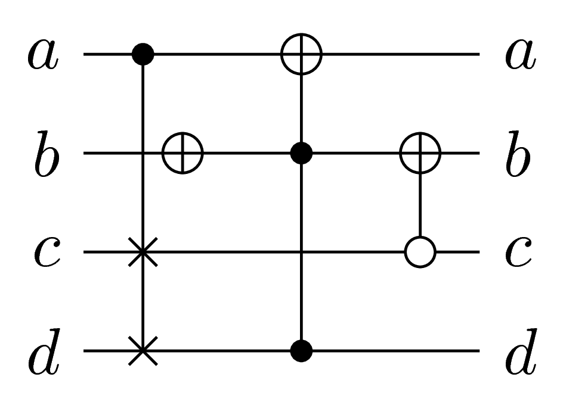
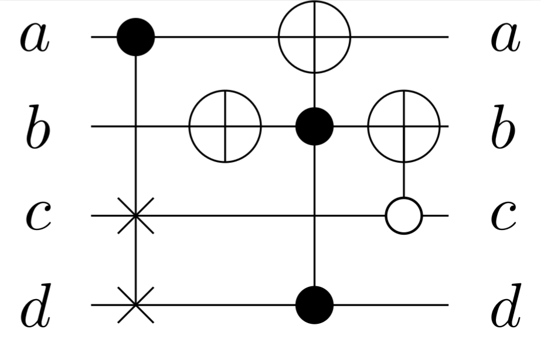

## Examples

This sections presents several code recipes, along with screen shots of their execution on a terminal, for making some basic work inside Revkit. For all of these instances, we will use Revkit's interactive mode in order to see each command along with its input. 

For the execution of these examples, we will supose that we are working on a directory that has three .real files describing circuits: `circuit1.real`, `circuit2.real` and `circuit3.real`.

## Load several data structures into stores and print statistics

In this example, we will read 3 different circuits into Revkit's circuit store, and we will print their statistics with the `ps` function and their ASCII representation with the `print`. The following code shows this proceedure done inside Revkit:


```
~$ revkit
revkit> #read each circuit
revkit> read_real circuit1.real
revkit> read_real -n circuit2.real
revkit> read_real -n circuit3.real
revkit> #show contents of the circuit store
revkit> store --show -c
[i] circuits in store:
     0: 4 lines, 4 gates
     1: 5 lines, 5 gates
  *  2: 3 lines, 5 gates
revkit> #print ASCII represntation
revkit> print -c
―⊕―――――●―⨯―
―――⊕―――⊕―○―
―――――⊕―○―⨯―

revkit> #print statistiics
revkit> ps -c
Lines:        3
Gates:        5
T-count:      7
Logic qubits: 4
revkit> #change store pointer
revkit> current -c 1
revkit> print -c
―⨯―――⊕―――●―
―⨯―――――●―○―
―――⨯―――――●―
―●―――――⊕―⨯―
―○―⨯―――――⨯―

revkit> ps -c
Lines:        5
Gates:        5
T-count:      23
Logic qubits: 6
revkit> current -c 0
revkit> print -c
―●―――⊕―――
―――⊕―●―⊕―
―⨯―――――○―
―⨯―――●―――

revkit> ps -c
Lines:        4
Gates:        4
T-count:      7
Logic qubits: 4


```
## Making diagrams

### Making diagram with Qpic

In this example, we will first read a circuit into Revkit and then export it as a qpic file, then exit Revkit and use Qpic from terminal to convert it to create a PNG image. The following code shows this proceedure done inside Revkit:
```
~$ revkit
revkit> #read circuit
revkit> read_real circuit1.real
revkit> print -c
―●―――⊕―――
―――⊕―●―⊕―
―⨯―――――○―
―⨯―――●―――

revkit> #write qpic file of circuit
revkit> write_qpic circuit1.qpic
revkit> quit

~$ #use qpic to convert the circuit to PNG
~$ qpic circuit1.qpic -f png -o circuit1.png
```

 Note that in the `qpic` command the `-f` flag indicates output format and `-o` flag indicates output file name The following picture is the final PNG image made by Qpic, the `circuit1.png` file.

<center>

</center>

### Making diagram via Latex

In this example we will read a circuit into revkit, export it as a .tikz file and compile it with Pdflatex to produce a PDF drawing of the same. The following code shows this proceedure done inside Revkit:
```
~$ revkit
revkit> read_real circuit1.real
revkit> print -c
―●―――⊕―――
―――⊕―●―⊕―
―⨯―――――○―
―⨯―――●―――

revkit> #write .tex file of the circuit ready to compile alone
revkit> write_tikz --standalone circuit1.tex
revkit> quit
~$ #use pdflatex to compile the .tex file and don't print many lines during the process.
~$ pdflatex -interaction=batchmode circuit1.tex
```

The following picture is the final PDF compiled by Pdflatex.

<center>

</center>


## Obtain truth table of reversible circuit
In this example we will simulate a reversible circuit to obtain its truth table and then export it as a SPEC file. The following code shows this proceedure done inside Revkit:
```
revkit> read_real circuit3.real
revkit> print -c
―⊕―――――●―⨯―
―――⊕―――⊕―○―
―――――⊕―○―⨯―

revkit> # convert Negative controls to positive controls using NOT gates
revkit> pos
revkit> #simulate circuit
revkit> convert --circuit_to_spec
revkit> #print truth table on the command line
revkit> print -s
000 111
001 001
010 101
011 110
100 011
101 010
110 100
111 000

revkit> #export truth table to a SPEC file
revkit> write_spec circuit3.spec
revkit> quit

```
Note that, as commented in the Reversible tools page, it is necessary to use the `pos` before the `convert` command to avoid problems. 

## Synthesize circuit from truth table using Transformed based synthesis
In this example, we will use the SPEC file created in the previous example to synthesis a circuit using the `tbs` example for Transformation based synthesis. The following code shows this proceedure done inside Revkit:

```
~$ revkit
revkit> #read the truth table that we want to convert to synthesis
revkit> read_spec circuit3.spec
revkit> print -s
000 111
001 001
010 101
011 110
100 011
101 010
110 100
111 000

revkit> #use transformation based synthesis to create a circuit
revkit> tbs
[i] run-time: 0.00 secs
revkit> #print the circuit in the command line
revkit> print -c
―⊕―●―●―●―●―⊕―●―●―⊕―⊕―●―●―
―●―●―⊕―⊕―●―●―⊕―――――――⊕―●―
―――⊕―●―――⊕―●―●―⊕―●―――――⊕―

revkit> #read the original .real file of the circuit
revkit> read_real -n circuit3.real
revkit> # convert negative controls to positive controls and Fredkin to Toffoli for simulation
revkit> pos
revkit> tof
revkit> # simulate both circuits and compare if they are equivalent
revkit> rec --id1 0 --id2 1
[i] run-time: 0.00 secs
[i] circuits are equivalent
```
